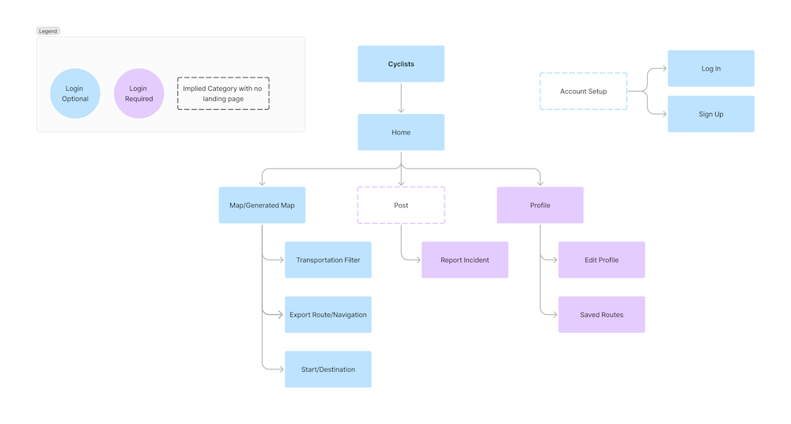
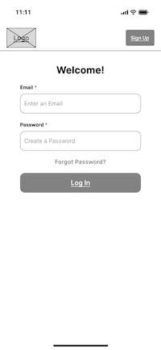
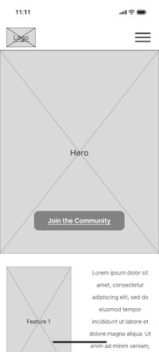
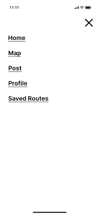
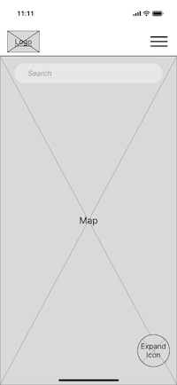
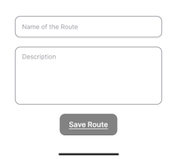

# User Experience Design

## App Map

## Wireframes

### Sign Up

A page that allows new users to create an account if they don't have one.

### Login

A page where existing users can log in to access their account.

### Home

A page that serves as the landing screen, welcoming users and offering an overview of key features.

### Menu

The navigation menu, accessible after clicking the hamburger icon, expands into an full-page overlay, and offers easy access to key pages.

### Map

A page that displays an interactive map showing bike lanes, reported incidents, and suggested routes in real time.

An overlay that appears after clicking the expand icon and provides additional map features.

An overlay that displays after clicking the Transportation Mode dropdown, showcasing the various modes of transportation available.

An overlay triggered after clicking the Save Route button, prompts the user to input a name and description for the route before saving.

### Report Incident

A page where users can report issues such as blocked bike lanes, reported construction, or accidents by providing necessary details.

### Profile

A page where users can view their personal information, saved routes, and preferences.

### Edit Profile

A page where users can update their personal details and other profile settings.

### Saved Routes

A page where users can view and access a detailed view of routes they have previously saved.

## Clickable Prototype

[Click Here](https://www.figma.com/proto/ZDR5EJvVDjZGdnJ8eB1hbe/Wireframe?page-id=0%3A1&node-id=9-16&node-type=canvas&viewport=740%2C270%2C0.2&t=1eM6nI68fbh4MnOo-1&scaling=scale-down&content-scaling=fixed&starting-point-node-id=9%3A16)
