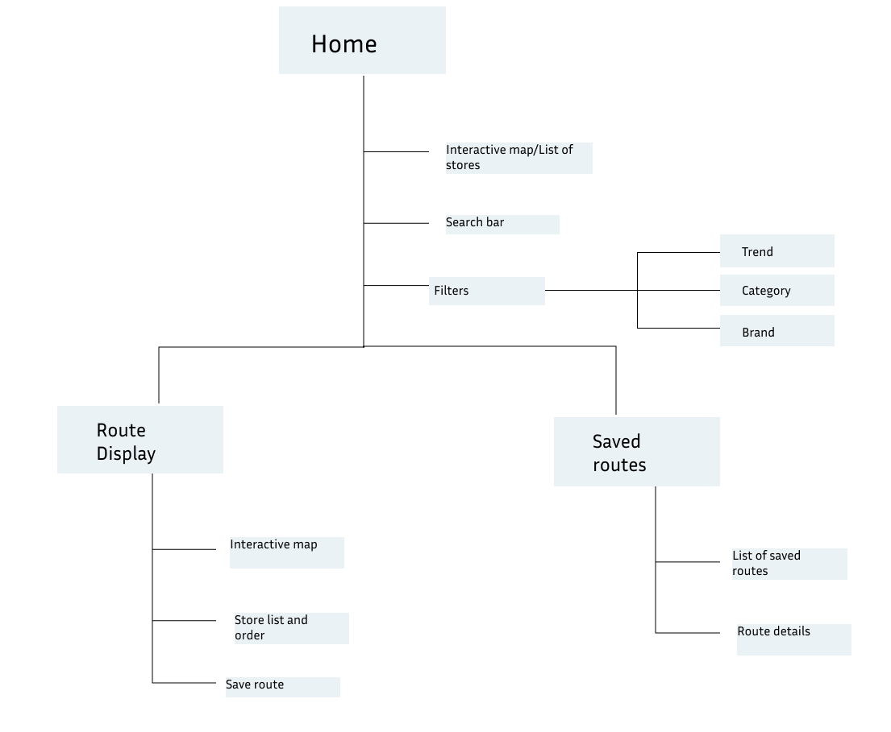
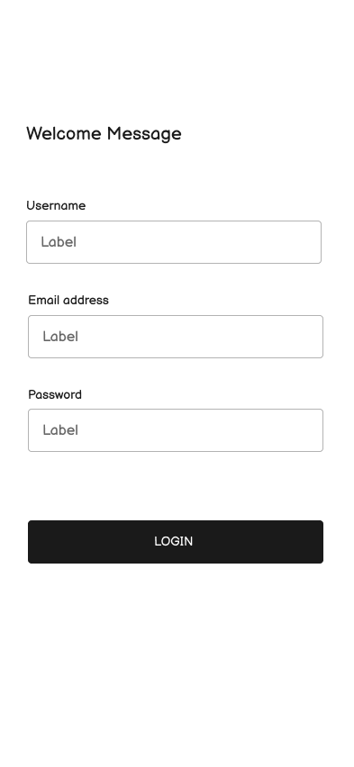

# User Experience Design

This repository contains the app map and wireframes for Seraphim.

## App Map
The app map shows an overview of the number of unique design templates needed, the overall hierarchy of our pages, and the different categories of screens in our app.

## Prototype
The prototype for our app can be found [here](https://www.figma.com/design/aGaCepqjZK6367ngUaQhHO/Seraphim-Wireframe?node-id=0-1&t=AmGmgiMJIXGDlAvT-1).

## Wireframes

### Signup Page
The signup page allow users to register with their name, username, email and password.

### Login Page
Users will login through the login page using their username and password.

### Forgot Password
If a user has forgotten their password, they will be redirected to this page and prompted to enter their email and a four-digit code sent to that email.

### Reset Password
Once the user has entered the correct code sent to their email, they will be allowed to reset their password on this page. 

### Home Page
This is the home page of the app. Users can view blogs, see the replies to a blog, their communities, and search for blogs as well.

### Home Page with Communities Dropdown
From the home page, users can view the current communities they've joined through a dropdown menu.

### Replies Page
This page shows all the replies to a blog post. 

### Post Page
Users can post blogs from this page. They have the option to attach images or GIFs, as well as write text.

### Post to Specific Community Page
When posting a blog, users can select which community page they want to post to through a dropdown menu.

### Reply to a Blog Page
Users can reply to a blog through this page. Replies may include text, images, or GIFs.

### Communities Page
This page shows a list of all communities in the app. Users can see community names, the description, and the logo.

### Sub Community 1 Page
This page displays information about a specific community. Users can join the community by clicking the join button.

### Joined Community 1 Page
If a user joins a community from the community's page, they will be notified of their new membership with a popup.

### Sub Community 2 Page
This page displays information about a specific community. Users can join the community by clicking the join button.

### Joined Community 2 Page
If a user joins a community from the community's page, they will be notified of their new membership with a popup.

### Sub Community 3 Page
This page displays information about a specific community. Users can join the community by clicking the join button.

### Joined Community 3 Page
If a user joins a community from the community's page, they will be notified of their new membership with a popup.

### Profile
This page shows the user profile, including personal information (name, pronouns, age, etc), their personal bio, interests and communities, and any custom information displayed by the user.

### Personal Blogs
This page shows all the blogs posted by the user.

### Personal Communities
This page shows all the communities the user is a part of.

### Edit Profile Blogs
Users can edit or customize their blog through this page. They have the option to change any personal information, profile picture, and custom images.

### Settings
Users can access their account settings, privacy settings, and accessibility settings from this page.

### Account Settings
From this page, users can view or edit their account information or deactivate their account.

### Deactivate Account
If a user chooses to deactivate their account, a popup will appear asking them to confirm their choice.

### Privacy
Users can access a list of blocked users, blocked communities, and muted words from this page. 

### Blocked Accounts
This page displays a list of blocked accounts. Blocked accounts will not show up on a user's home page. Users can unblock accounts from here.

### Blocked Communities
This page displays a list of blocked communities. Blocked communities will not show up on a user's home page. Users can unblock communities from here.

### Muted Words
This page displays a list of muted words. Blogs with these muted words will not show up on a user's home page. Users can unmute words from here.

### Accessibility
Users can change their display settings from this page. They can change the color mode, choose if they want to see images or not, and change text size. 

### Accessibility: Color Modes
Users can choose the color mode of the app (light or dark mode).

### Accessibility: Image Modes
Users can choose if they want to see images or not from this dropdown.

