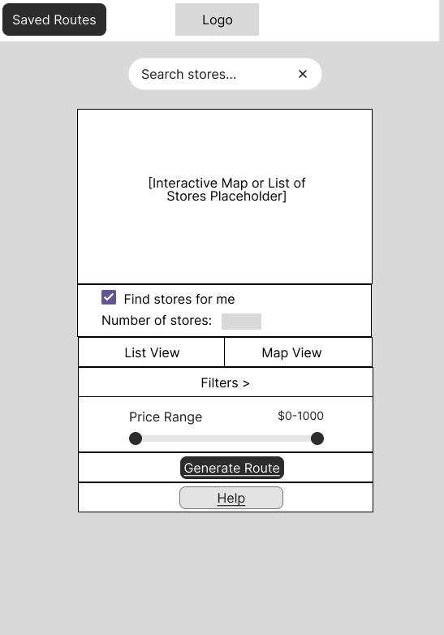
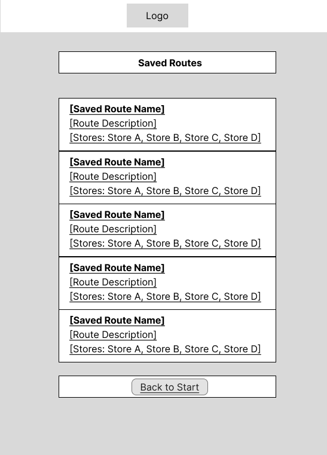
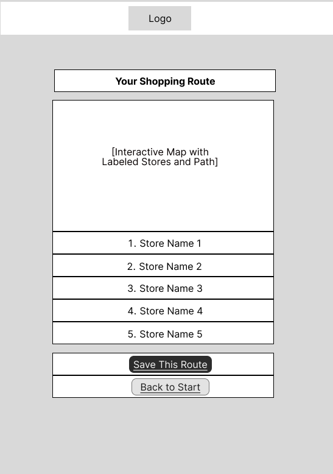
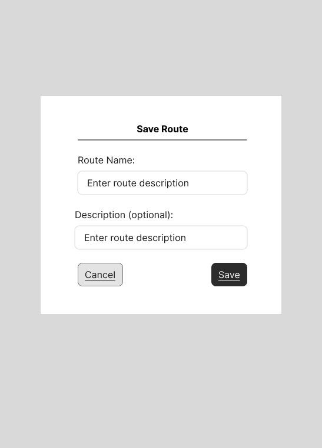
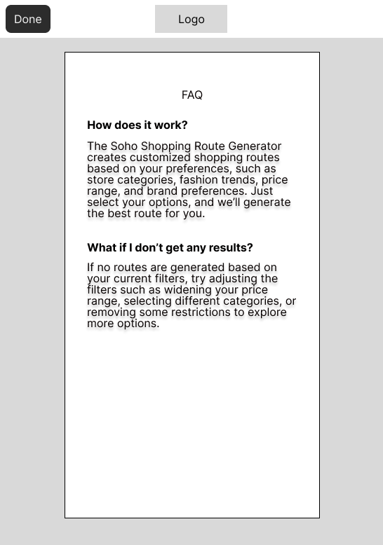
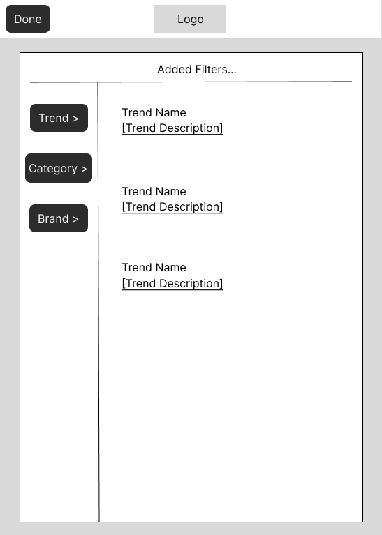
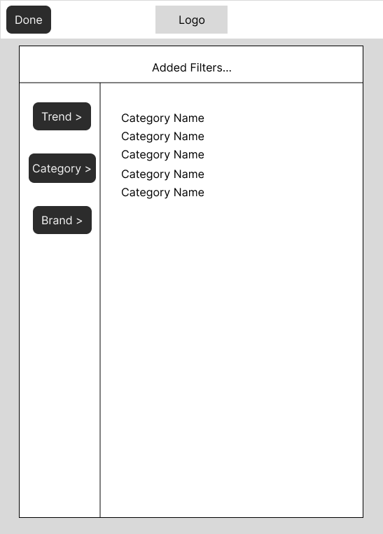
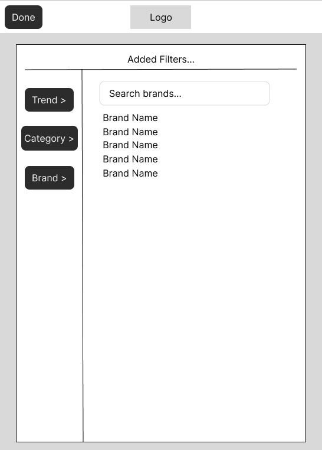

# User Experience Design

## App Map

### App Map Diagram:

- This app map demonstrates the hierarchical structure.

## Prototype: 
- [Click here to view the Prototype](https://www.figma.com/proto/4pMIu0YwSFD9xZOImZQjlR/Untitled?t=3ifLQ3UMotNtJlay-1)

## Wireframe Diagrams:

### 1. Start Page
- Allows users to search for stores, apply various filters, and generate a shopping route based on preferences.

### 2. Route Display Page
- Displays the shopping route on an interactive map and provides a list of stores.

### 3. Saved Routes Page
- Displays a list of  saved shopping routes. Each route can be selected for review or further action.

### 4. Save Route Modal
- Allows users to enter a name and optional description for the shopping route before saving it.

### 5. Help Page
- Offers an FAQ section.

### 6. Filter Page - Trend
- Allows users to filter the shopping route based on trends.

### 7. Filter Page - Category
- Allows users to filter the shopping route based on categories.

### 8. Brand Preference Page
- Allows users to filter the shopping route based on preferred brands.
