# User Experience Design ([Link To Prototype](https://www.figma.com/proto/6iv2amAkoy1R9CbaRpdki0/Bite-Buddy?node-id=34-151&t=yo619AsZYZqUY8vF-1))
## Site Map

  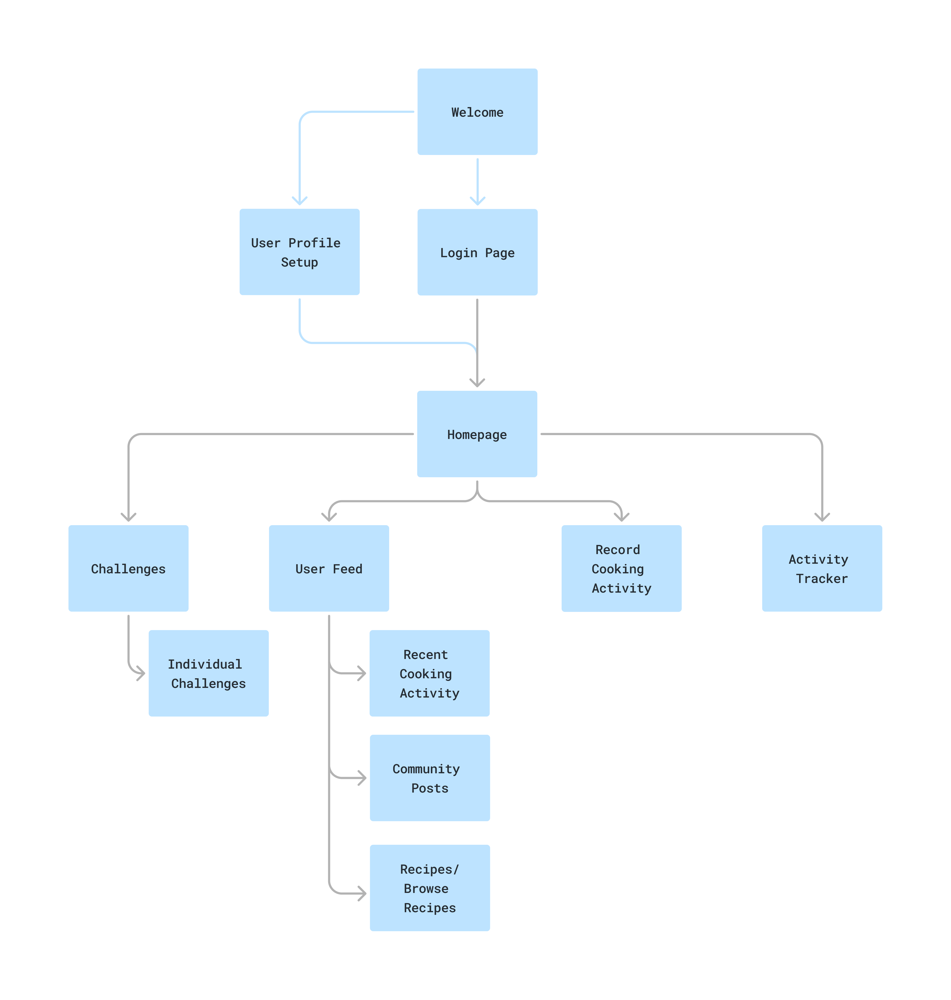

## Wireframes
### User Start Pages
#### Signup
User enters username, email address, and password needed to create a new account.

  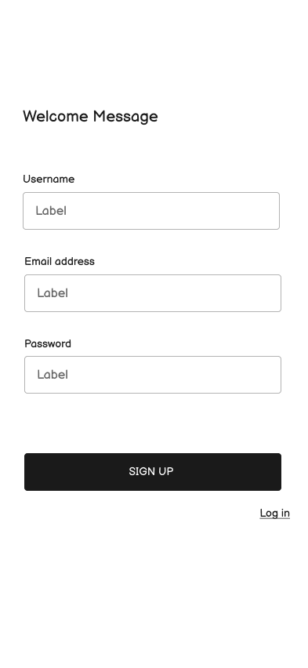

#### Profile Setup
User enters information they would like to display on their account, such as name, age, location, and a picture.

  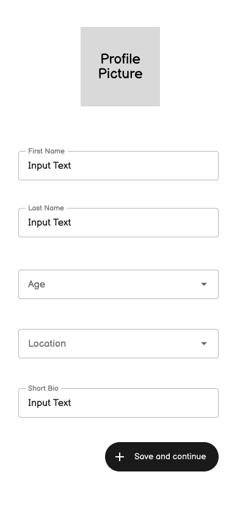

#### Login
User enters username, email address, and password needed to log in to an existing account.

  

### Menu Pages
#### Hamburger Dropdown
Users are able to access their challenge page, activities page, and record their screen for the current activity with a menu that has a larger capacity than the bottom bar.

  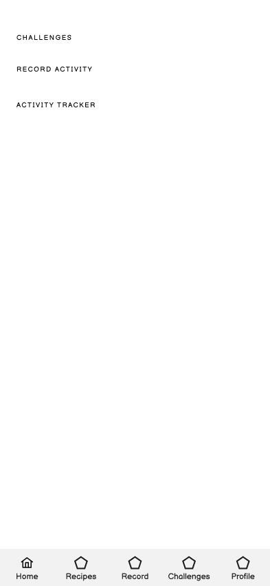

### Progression Pages

#### Primary Homepage

This page is the primary home page with navigations to different pages.

  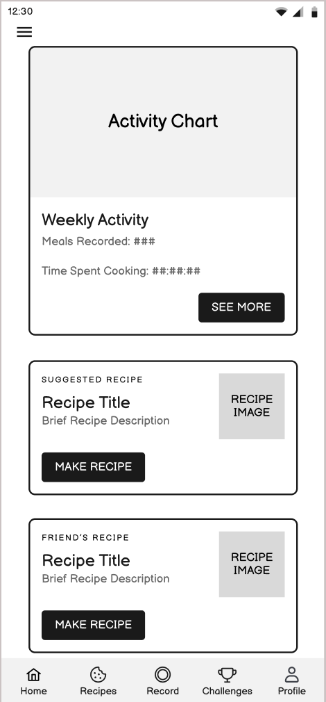

#### Activity Tracker (Progress)

Page shows user progression in a certain type of food category, giving user incentive to learn new foods and boast their profile to the community!
 - Progression is self approved with a picture of confirmation by user.
 - Progression is split by categorical descriptions of how difficult it is to make that food (i.e. novel vs expert difficulty recipes).

  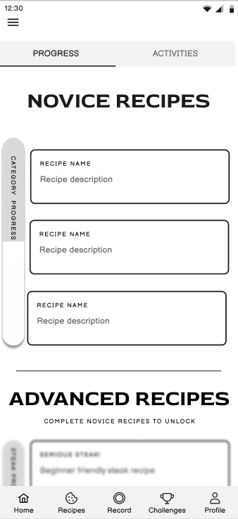

#### Activity Tracker (Activities)

Page shows a full list of activities.

  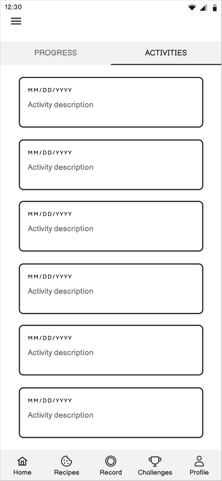

#### Record Activities

Page allows users to record activities and view progress.

  

### Recipes
#### Recipe Post
This page allows user to view recipes with descriptions, photos, and cooking instructionss. A brief preview is displayed with a button to navigate to a more detailed step-by-step recipe.

  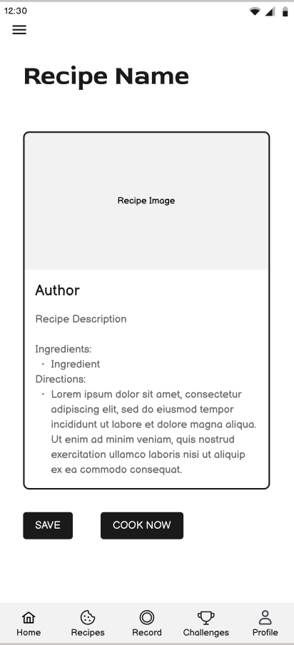

### Detailed Recipe
This page displays a detailed step-by-step recipe with detailed photos an descriptions.

  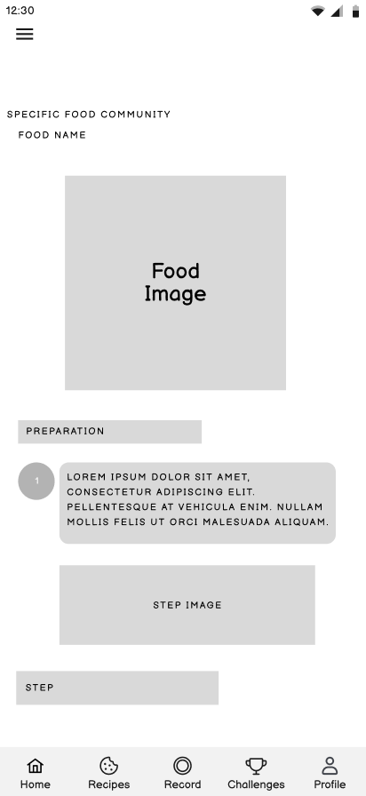

### Challenges
#### Challenge Home Page

Challenges are what the app or other users set it to be. It can be a test of skill or simply a challenge to make a type of food. 
 - Challenges are what excite the community and incite a goal to work towards
 - Challenges can be split on dificulties and types of food. You can search for different challenges you want to do.

  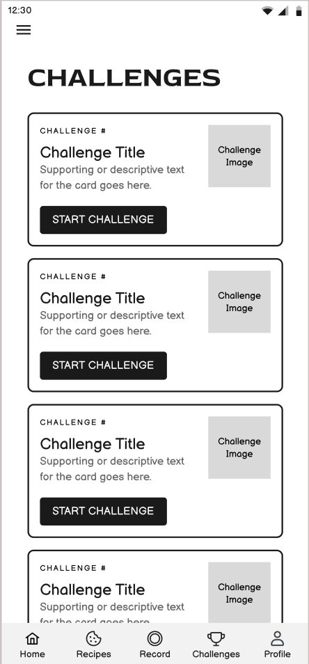

#### Individual Challenge page

This page displays an example of a single challenge started by the user.

  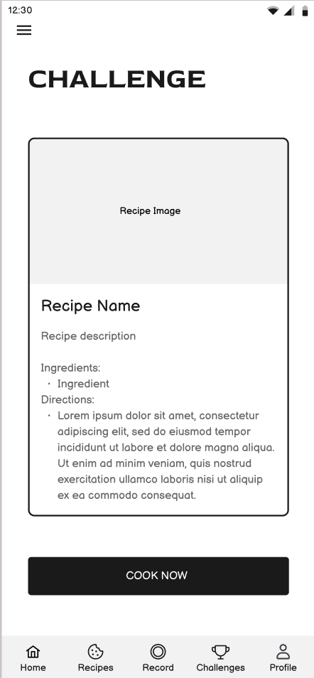