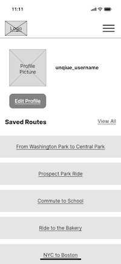

# UX Design for Restaurant Swipe App

This document outlines the user interface design for the Restaurant Swipe App. Below are the wireframes for each major screen of the app along with explanations of their purpose and functionality.

## Prototyping
- https://www.figma.com/proto/ikVN5KSBcoIDENYbIjQpUU/RestaSwipe?node-id=307-150&node-type=canvas&t=sOK6oeo0Wyq6J6G8-1&scaling=scale-down&content-scaling=fixed&page-id=1%3A27&starting-point-node-id=307%3A150&share=1

## App Map

1. **Signup/Login Screen**
2. **OTP Input Screen**
3. **Restaurant Feed (Swipe Interface)**
4. **Liked/Disliked Screens**
5. **Restaurant Details View**
6. **Profile Page**

## Wireframes

### 1. Signup/Login Screen

#### Purpose:
The signup/login screen allows users to either create a new account or log in using their credentials.

#### Key Functionality:
- Users can input their phone number to begin the login or signup process.
- A "Submit" button is provided to move forward in the authentication process.

### 2. OTP Input Screen

#### Purpose:
Users will enter an OTP (one-time password) sent to their phone for verification.

#### Key Functionality:
- The user must enter the OTP to verify their identity.
- Upon correct OTP submission, users can proceed to the main interface.

### 3. Restaurant Swipe Feed

#### Purpose:
The main interaction screen where users can browse restaurants by swiping.

#### Key Functionality:
- **Swipe left:** Dislike the current restaurant.
- **Swipe right:** Like the current restaurant.
- **Swipe up:** Go back to the previous restaurant.
- **Swipe down:** Move to the next restaurant.
- Tapping on the restaurant's name opens the details page.
- Tapping right or left on the image container will rotate which picture is in view.

### 4. Restaurant Liked/Disliked/Exit Confirmation

##### Liked:

##### Disliked:

#### Exit:

#### Purpose:
To provide visual feedback confirming the user's action of liking, disliking, or clicking exit link for a restaurant.

#### Key Functionality:
- After swiping right to like or left to dislike, users see confirmation messages like "Restaurant Liked" or "Restaurant Disliked", and after clicking exit link icon to visit restauraunts website, they'll be resented with confirmation.

### 5. Profile Page

#### Purpose:
The profile page allows users to see  their account details and the restaurants they've liked.

#### Key Functionality:
- Users can view their personal information and the list of restaurants they've interacted with.
- Each restaurant has labels indicating its cuisine and neighborhood.
- A delete option is provided to remove a restaurant from the liked list.

### 6. Restaurant Details View (from profile)

#### Purpose:
To give users more information about the restaurant, such as its cuisine and neighborhood, and to view images.

#### Key Functionality:
- Users can scroll through images of the restaurant.
- Restaurant details such as cuisine and neighborhood are displayed.
- A link to the restaurant’s website is provided for more information.

