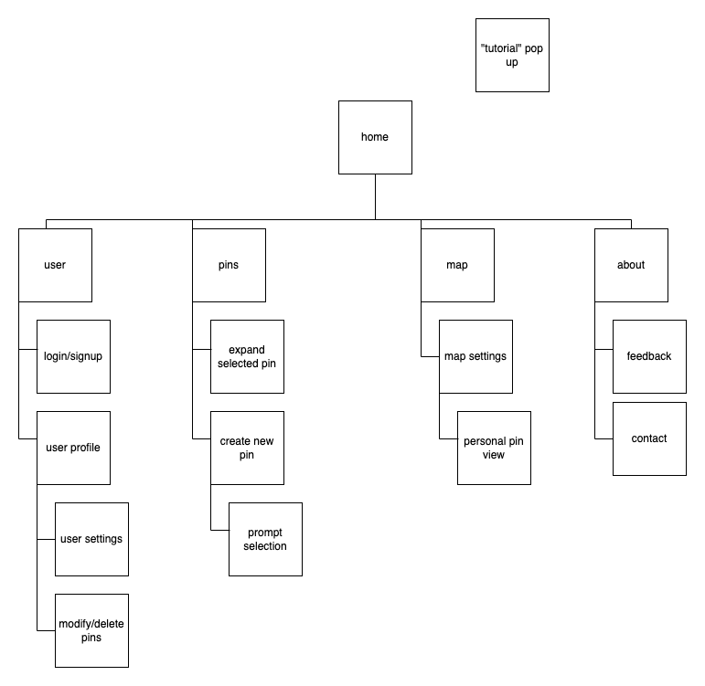

# User Experience Design

## Prototype
[Prototype Link](https://www.figma.com/proto/v1YjoBHtWq0Mobwi91uYEH/Figma-basics?node-id=684-128&node-type=canvas&t=jVHEdIFdUSIcgEFu-1&scaling=scale-down&content-scaling=fixed&page-id=609%3A10&starting-point-node-id=684%3A128)
## App Map

### Desceription
Here is the app map for our project task destroyer. We will have three main functions: tasks list, calendar view of tasks, and goal settings. And each of the page will have a following page for some detailed functions.

## Wireframes

### Home Page

* The home page for the application. It has two main parts.
- Show a few number of nearest due tasks.
- Navigate to three main functions

### Task List Page

* The task list page for the application. It has several main parts.
- Show the list of tasks all we have now, automatically list by nearest due date, but you can sort reversely by the "sort by" button
- Link to the edit/add tasks page.
- Tasks can be filter by different properties, all the properties will be set when adding the task.

### Add/Edit Task Page

* This is the page for add a new task or modify a current task.
- User can set different properties about the task including due date, priority.

### Calendar Page

* This is the page that give user an calendar view of tasks.
- The number of tasks due on a certain day will show on the box for each day.
- When you click on the box for the day, you will see the details for tasks.

### Day Page

* This is the following page from "Calendar Page"
- It shows the details about tasks due on a certain day.

### Goal Page

* This is the main page for "Goal Setting" function.
- It shows the current goals you have with their progress.
- You can add a new goal by the button on the page

### Setting Goal Page

* This is the setting goal page followed by "Goal Page".
- User can set a new goal by initialize the name, and the certain number of tasks want to finish, and set a due date for finishing the goal for themselves.
- The "Self Due Date" is for stimulate themselves, may not be the REAL due date for the tasks.